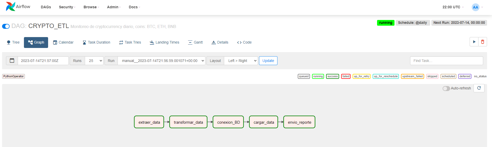
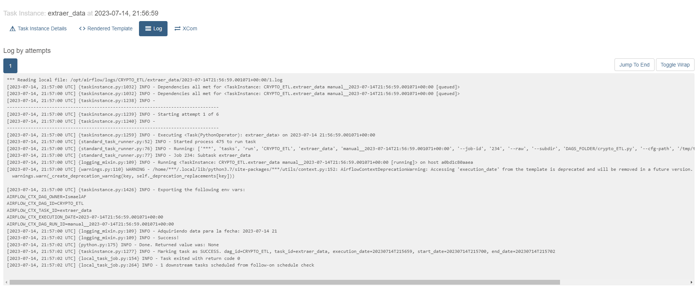
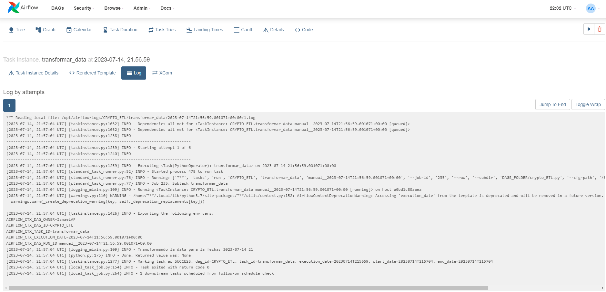
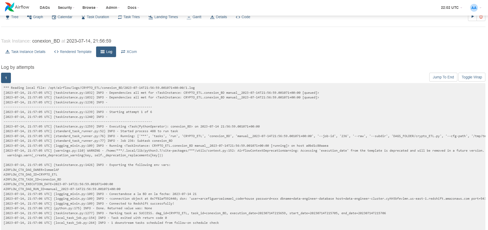
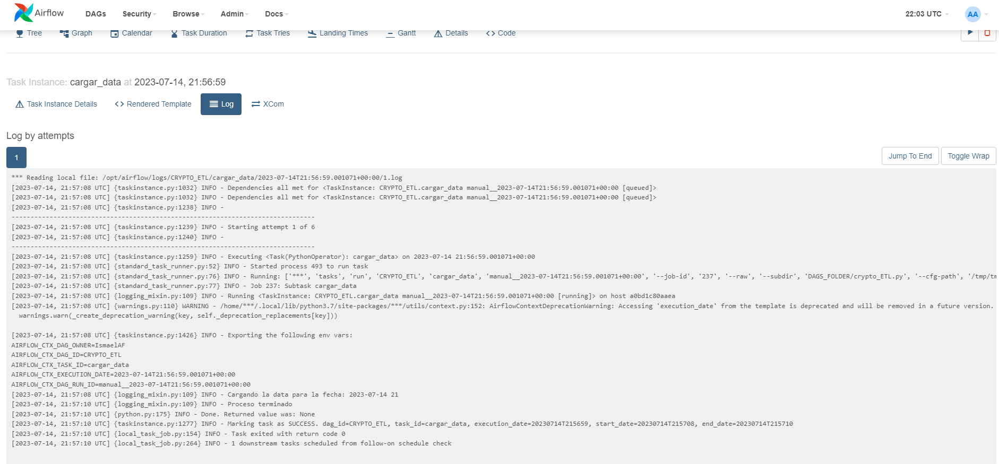
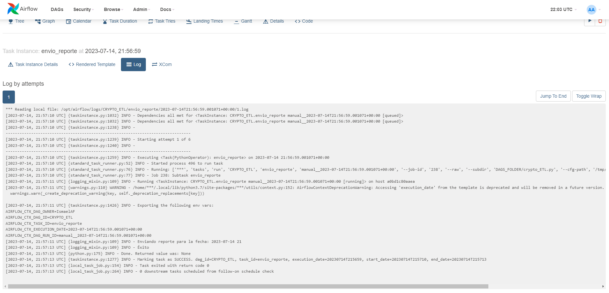
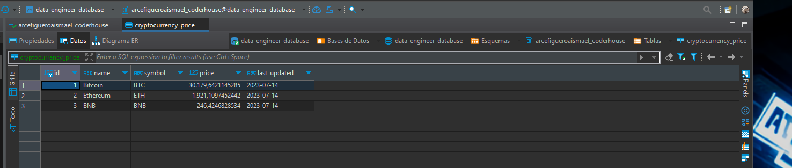

# Instrucciones para ejecutar este proyecto

# Usaremos la API publica de [coinmarketcap](https://www.coinmarketcap.com/) para recolectar informacion y enviar un reporte diario de las coins que son de nuestro interes.
# En este caso (BNB, BTC, ETH).

### Clonar el proyecto
```bash
git clone https://github.com/AFIsmael/data-engineering.Proyecto_Final.git

cd data-engineering.Proyecto_Final

code . 

```


### Ejecutar el docker compose

```bash
docker-compose up

```

## Corremos el DAG en nuestro admin de airflow (localhost:8080)<br><br>

## Una vez completado el workflow vemos el status de las tareas cumplidas correctamente<br>

```bash
TASKS:

        1 - EXTRAER_DATA
        2 - TRANSFORMAR_DATA
        3 - CONEXION_BD
        4 - CARGAR_DATA
        5 - ENVIO_REPORTE
```


<br><br>

<br><br>

<br><br>

<br><br>

<br><br>

<br><br><br><br><br>


## Chequeamos nuestra BD en redshift para corroborar que la carga de datos haya sido correcta
```bash
```
<br><br><br><br><br>


## Chequeamos nuestra casilla de gmail para corrobar que el reporte haya sido entregado
```bash
```

